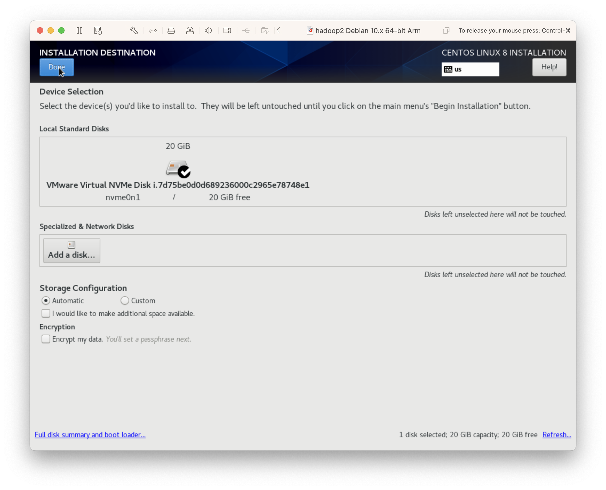
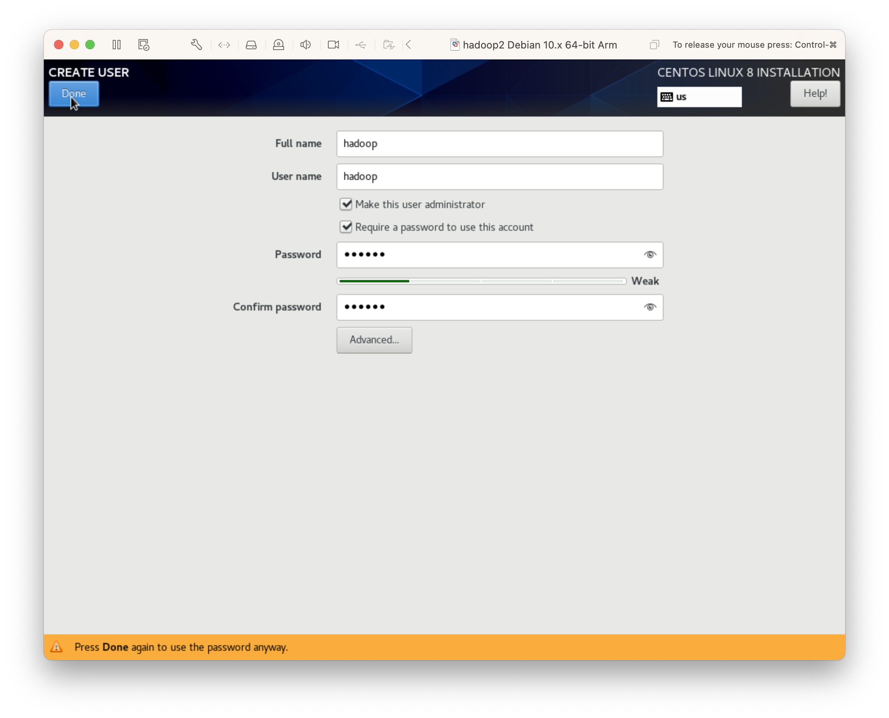
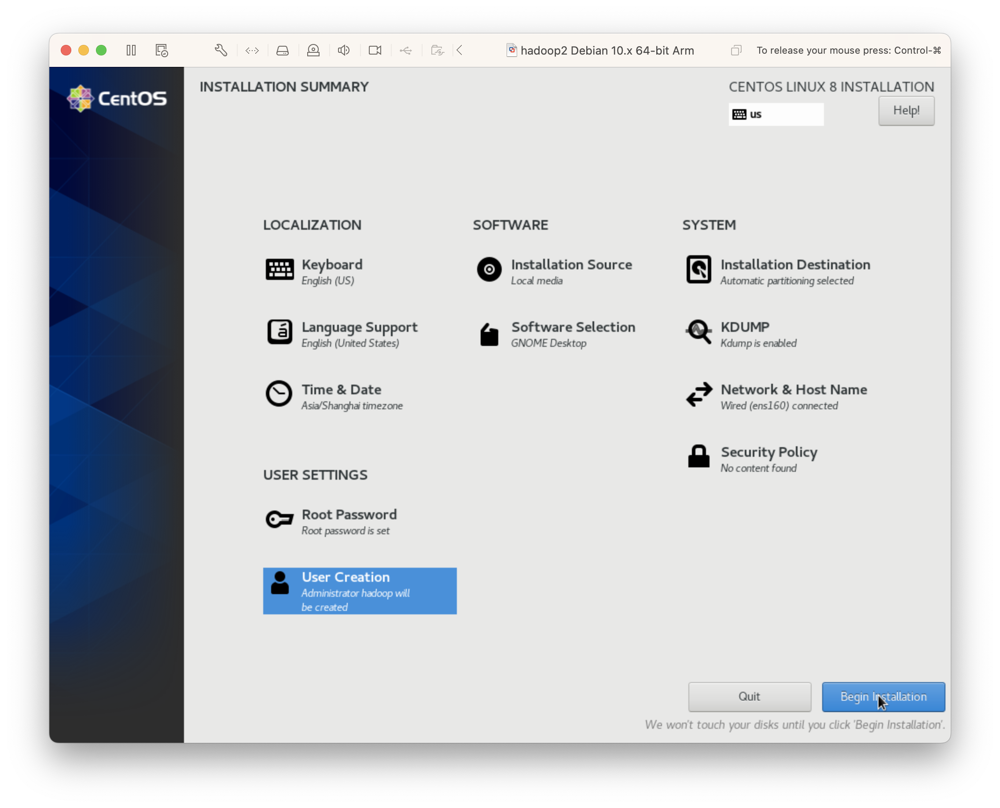
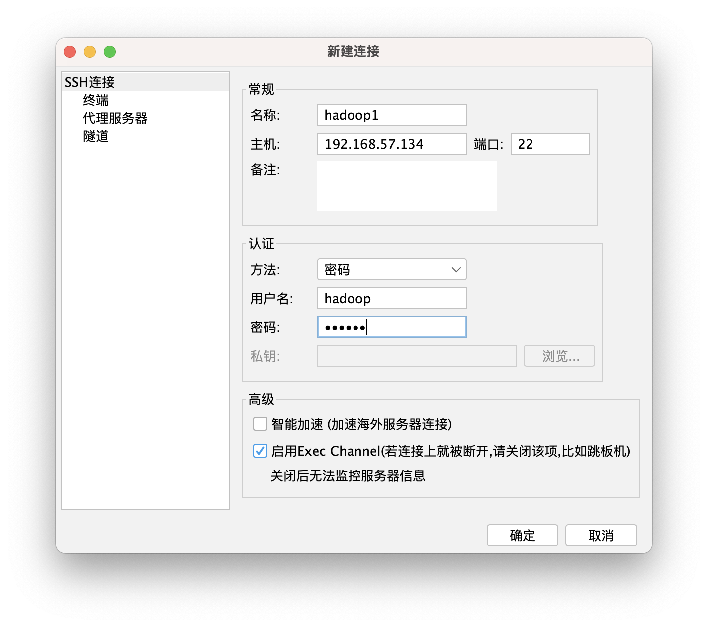
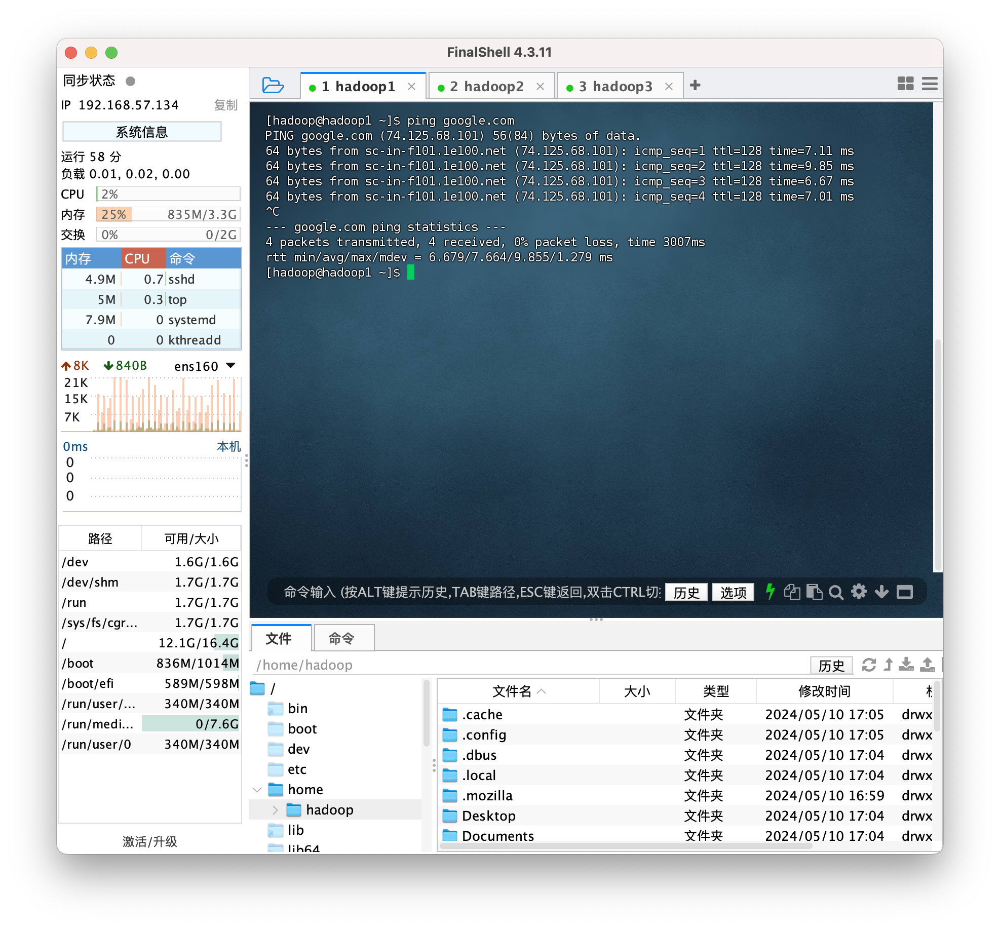
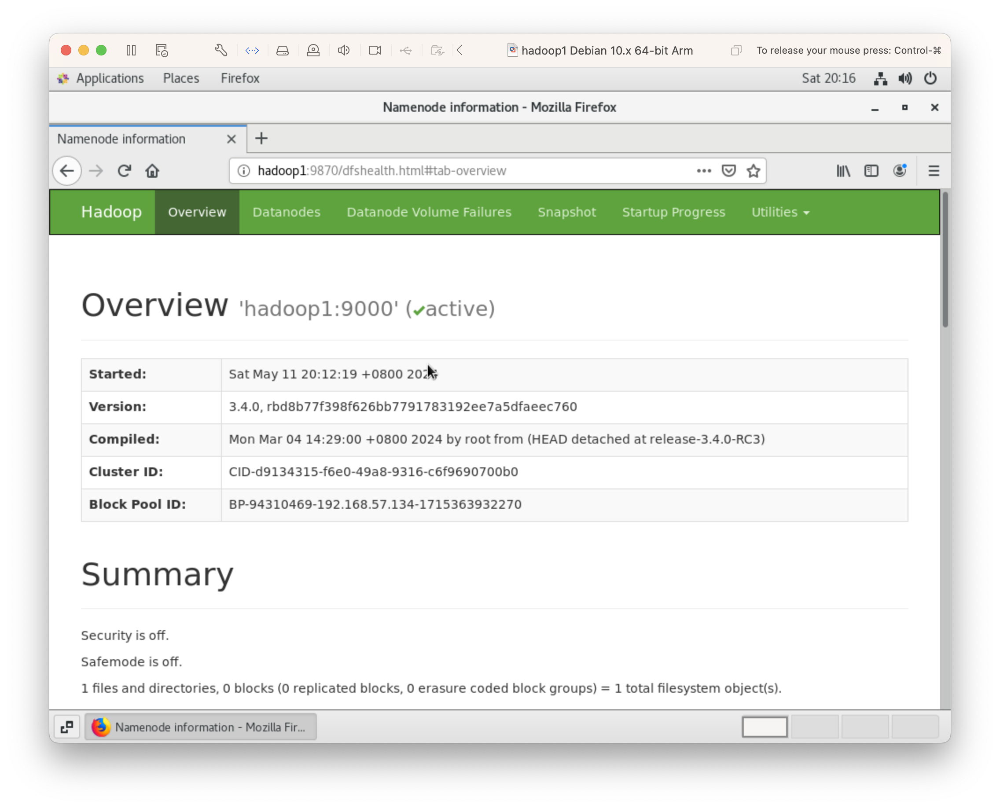
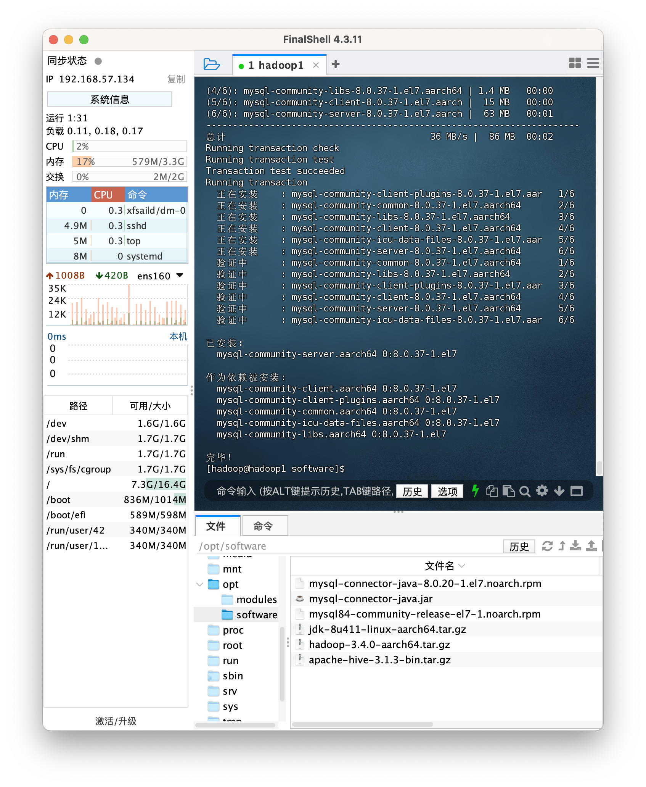
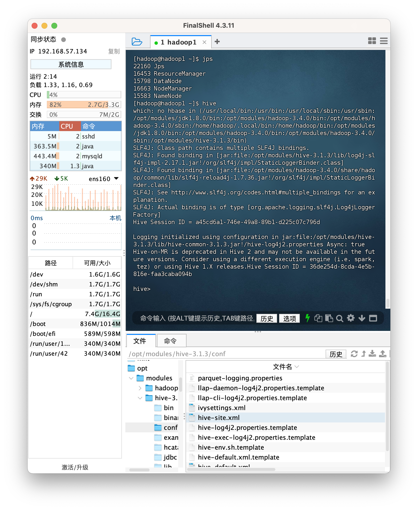
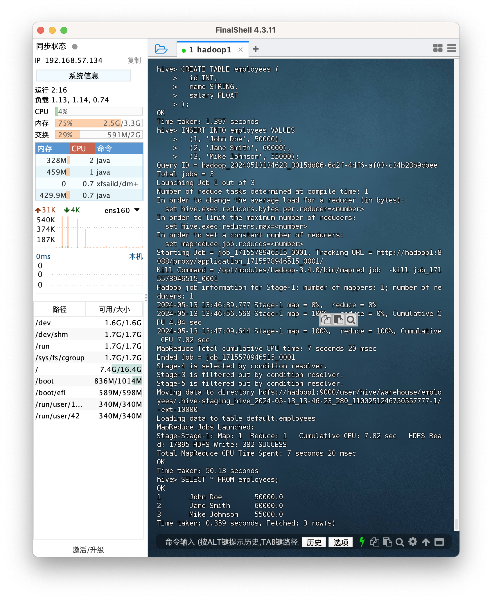

# Hadoop/Hive Installation on VMs，VMware 虚拟机安装 Hadoop/Hive 集群详细教程 (Macbook M1/M2)

## Setup Three VMs with CentOS7，安装三台 CentOS7 虚拟机（M1 Macbook，ARM 架构）

- VM1: hadoop1: 4G RAM + 20G Disk
- VM2: hadoop2: 2G RAM + 20G Disk
- VM3: hadoop3: 2G RAM + 20G Disk

Take host "hadoop2" as VM setup example
以安装 hadoop2 虚拟机作为例子

1. Select ISO Image，选择宿主机上的镜像文件
   
2. Select OS，选择 Debian10 操作系统
   
   
3. Select install CentOS7，选择安装
   
4. Select start up disk，选择硬盘
   
   
5. Select GNOME GUI，选择安装桌面
   
   
6. Select timezone，选择时区
   
7. Enable network and set host name，开启网络，设置主机名

- Note down the network interface，网口: ens160
- IP address，IP 地址: 192.168.57.135
- Default route (gateway)，网关: 192.168.57.2
  

8. Create user hadoop，创建 hadoop 用户
   
9. Begin installation，开始安装
   
10. During installation，安装中
    
11. Finished installation and reboot，安装完毕点击重启
    
12. Accept license，接受声明
    
13. Complete CentOS installation，完成
    
14. Login GUI as user hadoop，hadoop 用户登录
    
15. Enable date & time update, 同步节点之间的时间
    

## Config static IP address，设置静态 IP 地址

1. Use FinalShell software to SSH，使用 FinalShell 软件远程登录到三台虚拟机
   - Login as hadoop user，hadoop 用户登录
     
     
     
2. Edit network file in 3 machines，修改网络配置文件

- hadoop1 192.168.57.134
- hadoop2 192.168.57.135
- hadoop3 192.168.57.136

```
# Edit ifcfg-{network interface}
sudo vim /etc/sysconfig/network-scripts/ifcfg-ens160
```

```
...
BOOTPROTO=static
...
# append，追加
IPADDR=192.168.57.134
GATEWAY=192.168.57.2
NETMASK=255.255.255.0
DNS1=192.168.57.2
DNS2=114.114.114.114
PREFIX=24
```


3. Restart network，重启网络

```
/etc/init.d/network restart
```

4. Check new network，查看静态 IP

```
ifconfig
```


5. Try to ping google.com，尝试连接 google
   

## SSH without password，免密登录 SSH

1. Config known host names on 3 hosts，三台机器声明 host 对应的 IP

```
sudo vim /etc/hosts
```

```
# append，追加
192.168.57.134 hadoop1
192.168.57.135 hadoop2
192.168.57.136 hadoop3
```


2. Generate key pair under user "hadoop" on 3 hosts，三台机器上生成 hadoop 用户的密钥

```
su hadoop
ssh-keygen -t rsa
```

3. Distribute pub key to all 3 hosts，每台机器分发自己的公钥给所有三台机器

```
ssh-copy-id hadoop@hadoop1
ssh-copy-id hadoop@hadoop2
ssh-copy-id hadoop@hadoop3
```

```
# check added pub keys for each hosts，查看本台机器保存的其他机器的公钥
cat ~/.ssh/authorized_keys
```


4. Test SSH to other hosts without password，测试免密登录

```
# from hadoop1
ssh hadoop@hadoop2
# from hadoop3
ssh hadoop@hadoop1
```

5. Do the same above for root user only for hadoop1, because NameNode is on hadoop1，对 hadoop1 root 用户也做上述操作，因为 NameNode 在 hadoop1 上

```
# on hadoop1
su -
ssh-keygen -t rsa
ssh-copy-id root@hadoop1
ssh-copy-id root@hadoop2
ssh-copy-id root@hadoop3
```

6. Disable firewall on 3 hosts (important), 关闭三台机器防火墙 (重要)

```
sudo systemctl stop firewalld
sudo systemctl disable firewalld
```

## Install Java8 and Hadoop3.4.0，安装 Java8 和 Hadoop3.4.0

1. Download packages，下载软件包

- jdk (ARM64 Compressed Archive): https://www.oracle.com/java/technologies/downloads/#java8
- hadoop 3.4.0: https://dlcdn.apache.org/hadoop/common/hadoop-3.4.0/hadoop-3.4.0-aarch64.tar.gz

2. Create /opt/software and /opt/modules on 3 hosts，三台机器创建文件夹/opt/modules

```
sudo mkdir /opt/modules
sudo mkdir /opt/software
sudo chown hadoop:hadoop /opt/modules
sudo chown hadoop:hadoop /opt/software
```


3. Upload both to /opt/software on 3 hosts via FinalShell GUI，用 FinalShell 上传软件包到 hadoop1 目录/opt/software

4. Extract to /opt/modules on hadoop1，hadoop1 上解压缩到/opt/modules

```
su hadoop
tar -zxvf /opt/software/hadoop-3.4.0-aarch64.tar.gz -C /opt/modules
tar -zxvf /opt/software/jdk-8u411-linux-aarch64.tar.gz -C /opt/modules
cd /opt/modules
mv jdk1.8.0_411 jdk1.8.0
ls -l
```


5. Change default java，修改系统默认 Java（不是必须）

```
su -
# add my jdk to list
update-alternatives --install /usr/bin/java java /opt/modules/jdk1.8.0/bin/java 1
update-alternatives --install /usr/bin/javac javac /opt/modules/jdk1.8.0/bin/javac 1
# choose my jdk as default
update-alternatives --config java
update-alternatives --config javac
```


```
# check default java
ls -l /etc/alternatives/java
ls -l /etc/alternatives/javac
java -version
javac -version
```


6. Add JDK and Hadoop to $PATH，添加 jdk 和 hadoop 软件到全局环境变量

```
# root user
su -
vim /etc/profile
```

```
# append, 追加到最后
export JAVA_HOME=/opt/modules/jdk1.8.0
export PATH=$PATH:$JAVA_HOME/bin
export HADOOP_HOME=/opt/modules/hadoop-3.4.0
export PATH=$PATH:$HADOOP_HOME/bin:$HADOOP_HOME/sbin
```


```
source /etc/profile
```

```
# test hadoop
hadoop version
```


## Config HDFS, Yarn, MapReduce，配置组件

1. Navigate to hadoop config dir，去到 hadoop 配置文件夹

```
su hadoop
cd /opt/modules/hadoop-3.4.0/etc/hadoop
```

2. Edit config files，修改以下配置文件

```
vi core-site.xml
```

or
Use VS code，也可以使用其他编辑器


```
# core-site.xml
<configuration>
  <!-- 设置hdfs内部端口 -->
  <property>
    <name>fs.defaultFS</name>
    <value>hdfs://hadoop1:9000</value>
  </property>
  <!-- 设置数据/元数据存储位置 -->
  <property>
    <name>hadoop.tmp.dir</name>
    <value>/home/hadoop/data</value>
  </property>
</configuration>
```

```
# hadoop-env.sh
export JAVA_HOME=/opt/modules/jdk1.8.0

# The language environment in which Hadoop runs. Use the English
# environment to ensure that logs are printed as expected.
export LANG=en_US.UTF-8

# Location of Hadoop.  By default, Hadoop will attempt to determine
# this location based upon its execution path.
# export HADOOP_HOME=
export HADOOP_HOME=/opt/modules/hadoop-3.4.0
```

```
# hdfs-site.xml，HDFS配置
<configuration>
  <!-- 设置namenode网页访问地址 -->
  <property>
    <name>dfs.namenode.http-address</name>
    <value>hadoop1:9870</value>
  </property>
  <!-- 设置secondarynamenode网页访问地址 -->
  <property>
    <name>dfs.namenode.secondary.http-address</name>
    <value>hadoop2:9868</value>
  </property>
</configuration>
```

```
# mapred-site.xml，MapReduce配置
<configuration>
  <!-- 设置mapreduce为yarn模式 -->
  <property>
    <name>mapreduce.framework.name</name>
    <value>yarn</value>
  </property>
  <property>
    <name>yarn.app.mapreduce.am.env</name>
    <value>HADOOP_MAPRED_HOME=${HADOOP_HOME}</value>
  </property>
  <property>
    <name>mapreduce.map.env</name>
    <value>HADOOP_MAPRED_HOME=${HADOOP_HOME}</value>
  </property>
  <property>
    <name>mapreduce.reduce.env</name>
    <value>HADOOP_MAPRED_HOME=${HADOOP_HOME}</value>
  </property>
</configuration>
```

```
# yarn-site.xml，Yarn配置
<configuration>
  <!-- 设置hadoop1为resourcemanager -->
  <property>
    <name>yarn.resourcemanager.hostname</name>
    <value>hadoop1</value>
  </property>
  <!-- 开启shuffle服务 -->
  <property>
    <name>yarn.nodemanager.aux-services</name>
    <value>mapreduce_shuffle</value>
  </property>
  <!--NodeManager在启动时加载shuffleHandler类-->
  <property>
    <name>yarn.nodemanager.auxservices.mapreduce.shuffle.class</name>
    <value>org.apache.hadoop.mapred.ShuffleHandler</value>
  </property>
  <!-- 开启日志聚集功能 -->
  <property>
    <name>yarn.log-aggregation-enable</name>
    <value>true</value>
  </property>
  <!-- 日志聚集服务器地址 -->
  <property>
    <name>yarn.log.server.url</name>
    <value>http://hadoop1:19888/jobhistory/logs</value>
  </property>
  <!-- 设置日志保留7天 -->
  <property>
    <name>yarn.log-aggregation。retain-seconds</name>
    <value>604800</value>
  </property>
</configuration>
```

```
# workers，声明所有DataNode机器，无空格
hadoop1
hadoop2
hadoop3
```

3. Copy /opt/modules to other 2 hosts，复制/modules 到另外两台机器

```
# on hadoop1
scp -r /opt/modules/* hadoop@hadoop2:/opt/modules
scp -r /opt/modules/* hadoop@hadoop3:/opt/modules
```

4. Copy /etc/profile to other 2 hosts，拷贝环境变量设置到另外两台机器

```
# on hadoop1
scp /etc/profile root@hadoop2:/etc
# on hadoop2
source /etc/profile
# on hadoop1
scp /etc/profile root@hadoop3:/etc
# on hadoop3
source /etc/profile
```

```
# change default Java for hadoop2, hadoop3 （不是必须）
su -
# add my jdk to list
update-alternatives --install /usr/bin/java java /opt/modules/jdk1.8.0/bin/java 1
update-alternatives --install /usr/bin/javac javac /opt/modules/jdk1.8.0/bin/javac 1
# choose my jdk as default
update-alternatives --config java
update-alternatives --config javac
```

5. Sync hadoop config if config changes, hadoop1 修改 hadoop 配置后同步配置用以下命令

```
# on hadoop1
rsync -avz /opt/modules/hadoop-3.4.0/etc/hadoop/ hadoop@hadoop2:/opt/modules/hadoop-3.4.0/etc/hadoop/
rsync -avz /opt/modules/hadoop-3.4.0/etc/hadoop/ hadoop@hadoop3:/opt/modules/hadoop-3.4.0/etc/hadoop/
```

## Start Hadoop (HDFS, YARN)，启动 Hadoop

- hadoop1: NameNode, DataNode, ResourceManager, NodeManager
- hadoop2: SecondaryNameNode, DataNode, NodeManager
- hadoop3: DataNode, NodeManager

1. Format namenode，格式化 NameNode

```
# on hadoop1
hdfs namenode -format
```

You should see namenode meta data dir is created, 检查 namenode 数据文件夹

```
# on hadoop1
cd /home/hadoop/data/dfs/name/current
cat VERSION
```

2. Start all deamons，启动所有守护进程

```
# on hadoop1
start-all.sh
```

- hadoop1，使用 jps 查看进程
  
- hadoop2，使用 jps 查看进程
  
- hadoop3，使用 jps 查看进程
  

3. Start MapReduce job history server，启动 MapReduce 历史服务器

```
# on any host
mapred --daemon start historyserver
```


4. Check Web UI，虚拟机上查看服务对应网页

- HDFS: http://hadoop1:9870
  
- YARN: http://hadoop1:8088
  Note 3 active node, 注意应该有 3 个活跃节点，如果只有一个，检查防火墙是否关闭
  
- MapReduce History Server: http://hadoop1:19888
  

5. Access on host machine，宿主机上访问网页

```
sudo vi /etc/hosts
```

```
192.168.57.134 hadoop1
192.168.57.135 hadoop2
192.168.57.136 hadoop3
```


## Run MapReduce Example Jar, 运行示例 MapReduce 程序

1. Create input dir in HDFS, HDFS 中创建输入文件夹

```
hdfs dfs -mkdir /input
```

2. Create and upload files to input dir, 创建并上传 wordcount 文件

```
vim ~/words.txt
```

```
hello hadoop
hello world
hello hadoop
mapreduce
```

```
hdfs dfs -put ~/words.txt /input
```

```
hdfs dfs -ls /input
```


3. Run example program, 运行示例程序

```
# /output doesn't exist, /output路径不能存在
hadoop jar /opt/modules/hadoop-3.4.0/share/hadoop/mapreduce/hadoop-mapreduce-examples-3.4.0.jar wordcount /input /output
```

4. Print wordcount output, 打印 wordcount 结果

```
hdfs dfs -ls /output
hdfs dfs -cat /output/part-r-00000
```


5. Yarn web UI and historyserver
   
   
   

## Stop hadoop, 关闭 hadoop

1. Stop all deamons，停止所有守护进程

```
# on hadoop1
mapred --daemon stop historyserver && stop-all.sh
```

2. Poweroff 3 machines，关闭虚拟机

```
poweroff
```


3. Take snapshot for each machine，截取虚拟机快照
   

# Install Hive on Hadoop，hadoop 基础上安装 hive

## Install MySQL on namenode (hadoop1)，hadoop1 节点安装 MySQL

Hive use MySQL to store meta data， mysql 作为 hive 元数据管理， 底层把文件映射成表
Hive support MySQL versions，hive 推荐支持的 mysql 版本:
MySQL 5.7.x
MySQL 8.0.x (Only for Hive3.1.x versions)

We use MySQL 8.0.x，我们选择 8.0.x 版本

1. Check already installed mysql, 删除之前的 mysql

```
sudo yum list installed | grep mysql

#Remove previous mysql，如有则删除
sudo yum remove ${xxx}
```

（仅参考）删除以前 mysql data directory "sudo rm -rf /var/lib/mysql"

2. Install mysql-8.0.37, 安装 mysql-8.0.37

- 参考官方文档 https://dev.mysql.com/doc/refman/8.0/en/linux-installation-yum-repo.html
- 下载包 https://dev.mysql.com/get/mysql84-community-release-el7-1.noarch.rpm
- 上传到/opt/software

```
sudo yum install /opt/software/mysql84-community-release-el7-1.noarch.rpm
yum repolist all | grep mysql

# enable 8.0.37 instead of 8.4，开启8.0.37，关闭默认8.4
sudo yum-config-manager --disable mysql-8.4-lts-community
sudo yum-config-manager --disable mysql-tools-8.4-lts-community
sudo yum-config-manager --enable mysql80-community
sudo yum-config-manager --enable mysql-tools-community

# start to install mysql，开始安装mysql到Hadoop1
sudo yum install mysql-community-server
```



3. Start MySQL as service, 后台启动 MySQL

```
sudo systemctl start mysqld
sudo systemctl status mysqld
# 后台关闭mysql
# sudo systemctl stop mysqld
# 取消开机自启动
# sudo systemctl disable mysqld
```


4. Find the temporary password for mysql root user from log，找到 root 用户临时密码，登录后修改密码

```
sudo grep 'temporary password' /var/log/mysqld.log
[Server] A temporary password is generated for root@localhost: :vwyr%Eih0nx
```

Change root user password, passwords contain at least one uppercase letter, one lowercase letter, one digit, and one special character, and that the total password length is at least 8 characters. 至少一个大写，一个小写，一个数字，一个符号，至少 8 位

```
mysql -u root -p
# change password, 修改密码
ALTER USER 'root'@'localhost' IDENTIFIED BY '{new password}';
eixt;
```

5. Test login as root user with new password，测试新密码登录

```
mysql -u root -p
SHOW DATABASES;
```


6. Create mysql user "hive", 创建新 mysql 用户 hive，密码 Hive123456.

```
CREATE USER 'hive'@'localhost' IDENTIFIED BY 'Hive123456.';
# 将所有数据库的所有表的所有权限赋给hive
GRANT ALL ON *.* TO 'hive'@'localhost';
FLUSH PRIVILEGES;
```


7. Check if hive can login remotely, if "Host" is "localhost" means can only login locally，允许 mysql hive 用户远程登录 mysql

```
SELECT Host, User FROM mysql.user WHERE User = 'hive';
UPDATE mysql.user SET Host = '%' WHERE User = 'hive';
FLUSH PRIVILEGES;
exit;
```

## Install hive, 安装 hive

1. Download hive-3.1.3，下载 hive: https://mirrors.tuna.tsinghua.edu.cn/apache/hive/hive-3.1.3/apache-hive-3.1.3-bin.tar.gz

```
tar -zxvf /opt/software/apache-hive-3.1.3-bin.tar.gz -C /opt/modules/
cd /opt/modules/
mv apache-hive-3.1.3-bin hive-3.1.3
```

2. Download mysql java connector, 下载 mysql java 连接器: https://downloads.mysql.com/archives/c-j/

安装 mysql java connector，将 mysql-connector-java.jar 拷贝到/hive-3.1.3/lib 目录下

```
sudo yum install /opt/software/mysql-connector-j-8.0.20-1.el7.noarch.rpm
cp /usr/share/java/mysql-connector-java.jar /opt/modules/hive-3.1.3/lib
```

3. Add hive to env path, 添加 hive 到环境变量

```
sudo vim /etc/profile
# 追加
export HIVE_HOME=/opt/modules/hive-3.1.3
export PATH=$PATH:$HIVE_HOME/bin
```

```
source /etc/profile
```

4. Enable hive config, create hive-site.xml, 开启 hive 默认配置，修改 hive 其他配置

```
cd /opt/modules/hive-3.1.3/conf
mv hive-default.xml.template hive-default.xml
touch hive-site.xml
vim hive-site.xml
```

```
# hive-site.xml
<?xml version="1.0" encoding="UTF-8" standalone="no"?>
<?xml-stylesheet type="text/xsl" href="configuration.xsl"?>

<configuration>
  <!-- 指定mysql地址和数据库 -->
  <property>
    <name>javax.jdo.option.ConnectionURL</name>
    <value>jdbc:mysql://localhost:3306/hive_metastore?createDatabaseIfNotExist=true</value>
  </property>
  <!-- 指定java连接mysql类 -->
  <property>
    <name>javax.jdo.option.ConnectionDriverName</name>
    <value>com.mysql.cj.jdbc.Driver</value>
  </property>
  <!-- 指定连接mysql用户hive -->
  <property>
    <name>javax.jdo.option.ConnectionUserName</name>
    <value>hive</value>
  </property>
  <!-- hive用户mysql密码 -->
  <property>
    <name>javax.jdo.option.ConnectionPassword</name>
    <value>Hive123456.</value>
  </property>
</configuration>
```

5. Initialize hive metadata DB, 初始化 hive 元数据库

```
schematool -dbType mysql -initSchema
mysql -u hive -p
SHOW DATABASES;
```

登录发现 hive_metastore 库被创建


6. 开启 hadoop 后，启动 hive

```
start-all.sh
# wait for a while
hive
```



## Test HiveQL, 测试 hive，HiveQL

1. create hive table, 创建表 employee

```
CREATE TABLE employees (
  id INT,
  name STRING,
  salary FLOAT
);
```

2. Insert dumy data, 插入数据，底层运行 mapreduce

```
INSERT INTO employees VALUES
  (1, 'John Doe', 50000),
  (2, 'Jane Smith', 60000),
  (3, 'Mike Johnson', 55000);
```

3. Select data, 查找数据

```
SELECT * FROM employees;
```

```
# exit, 退出hive
quit;
```



4. Check yarn web ui http://hadoop1:8088, 查看 yarn web ui，mapreduce 程序
   

5. Check data file on HDFS

```
hdfs dfs -ls /user/hive/warehouse
hdfs dfs -ls /user/hive/warehouse/employees
hdfs dfs -cat /user/hive/warehouse/employees/000000_3
```


数据用文件（类似 csv）进行存储，所以需要元数据管理把文件转化为结构化的数据表

6. Another option is start hiveserver2, 也可以启动 hiveserver2 服务，使用第三方软件（如 DBeaver）**远程连接 hive**

7. Add hadoop configuration, 需要修改 hadoop 配置 proxyuser “hadoop”，允许任何 hosts 使用 hadoop 用户的身份

```
# core-site.xml, 追加
<property>
  <name>hadoop.proxyuser.hadoop.hosts</name>
  <value>*</value>
</property>
<property>
  <name>hadoop.proxyuser.hadoop.groups</name>
  <value>*</value>
</property>
```

```
# sync config, 同步hadoop配置
rsync -avz /opt/modules/hadoop-3.4.0/etc/hadoop/ hadoop@hadoop2:/opt/modules/hadoop-3.4.0/etc/hadoop/
rsync -avz /opt/modules/hadoop-3.4.0/etc/hadoop/ hadoop@hadoop3:/opt/modules/hadoop-3.4.0/etc/hadoop/
```

8. Connect hiveserver2 with beeline (build-in), 用 beeline 客户端连接 hiveserver2

```
# Start, 启动hiveserver2
hiveserver2
```

新开 terminal，使用自带客户端 beeline 连接，匿名用户

```
beeline -u jdbc:hive2://hadoop1:10000/
show tables;
```


- Check web ui, 访问 Web UI: http://hadoop1:10002
- 可以看到有一个匿名连接


9. Connect hiveserver2 with DBeaver, 使用 DBeaver 客户端连接 hiveserver2，匿名用户

- URL: jdbc:hive2://hadoop1:10000/
- Port，端口: 10000
- No username, password，匿名用户
  
