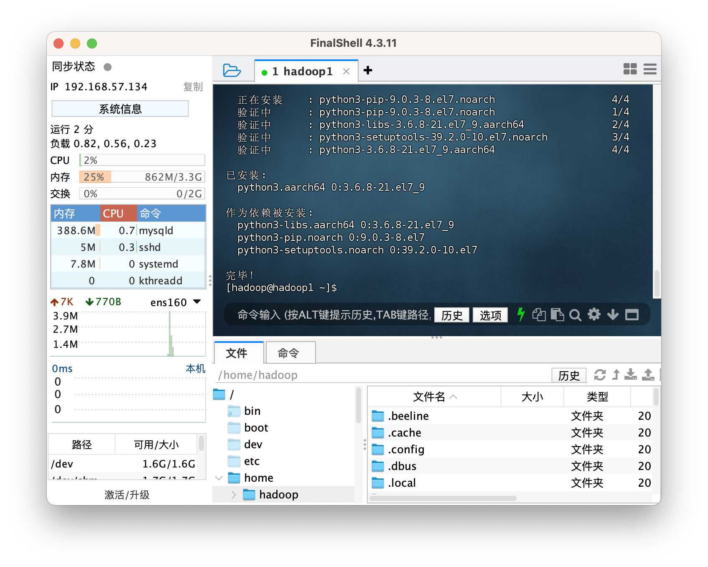
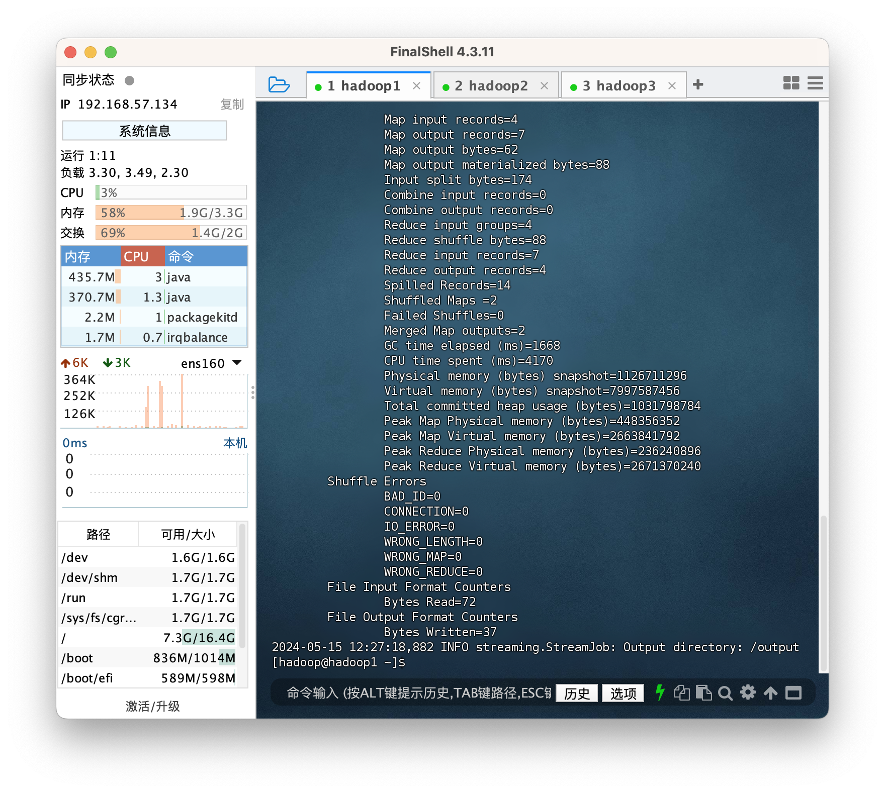
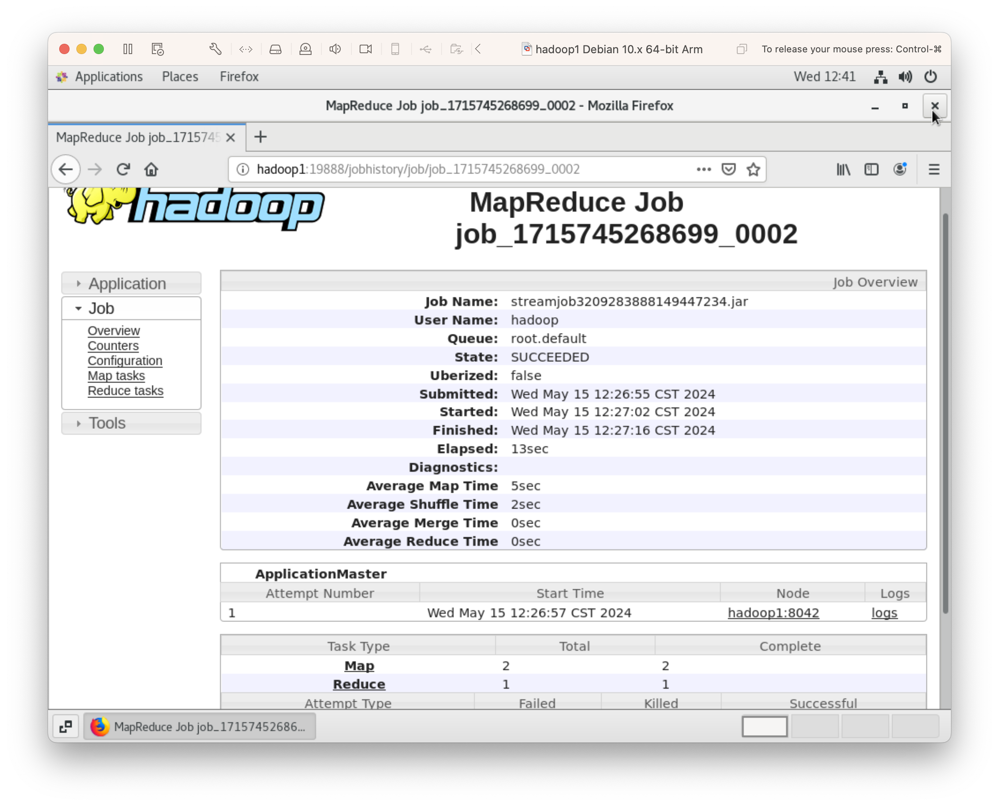
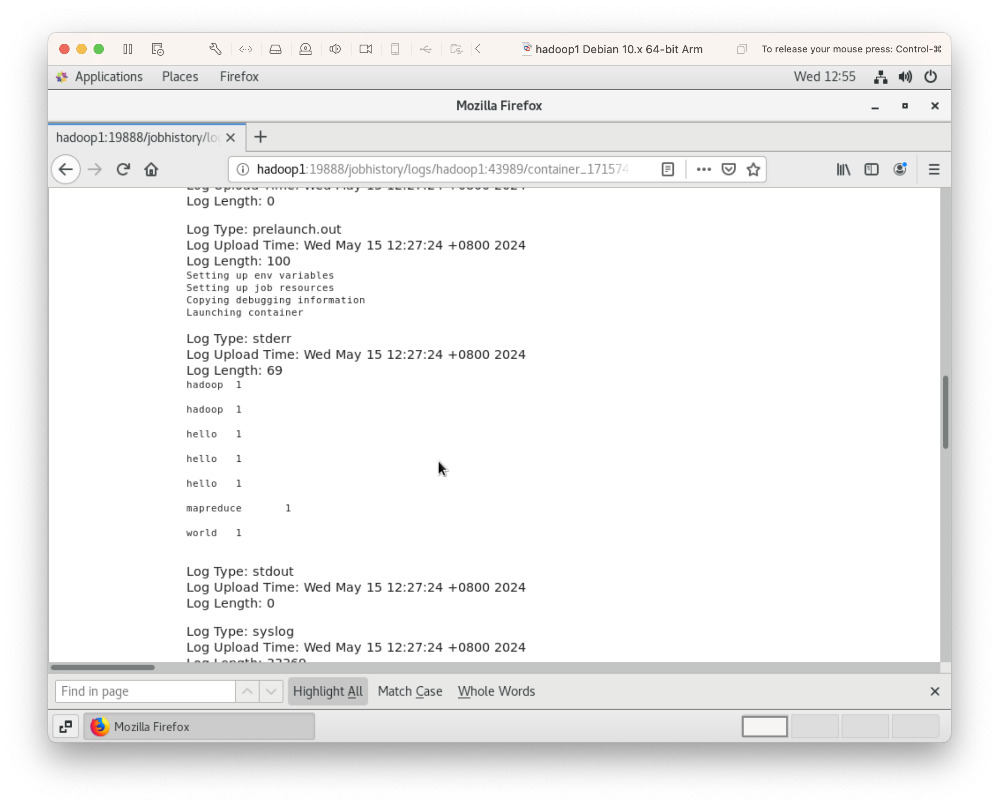
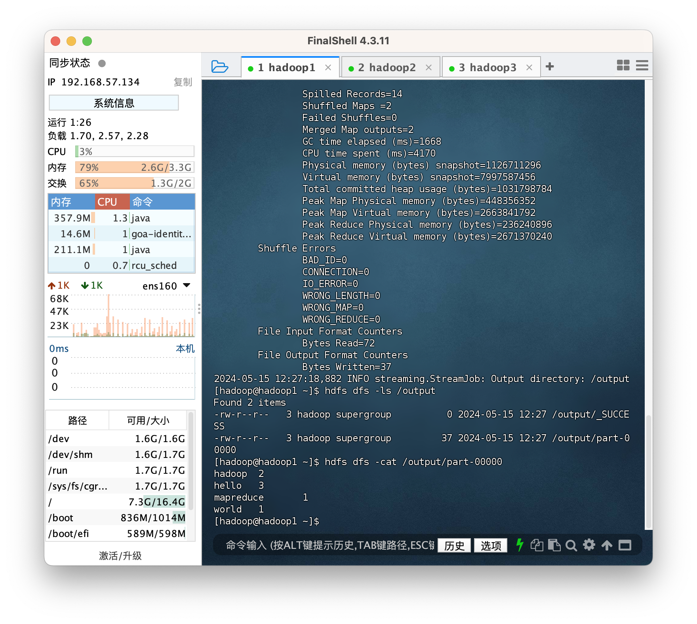

安装 hadoop 参考上一篇：[安装 hadoop](https://blog.csdn.net/Jacob12138/article/details/138716667)

# Write MapReduce program with Hadoop Streaming，使用 Hadoop Streaming 编写 MapReduce 程序

- 官方文档： https://hadoop.apache.org/docs/current/hadoop-streaming/HadoopStreaming.html
- Hadoop Streaming is a utility that allows you to use any programming language to write MapReduce jobs for Hadoop. It provides a way to process data in Hadoop using standard input and output streams, making it flexible and language-agnostic. Hadoop Streaming 是一个实用工具，它允许您使用任何编程语言为 Hadoop 编写 MapReduce 作业。它提供了一种使用标准输入和输出流在 Hadoop 中处理数据的方式，使其具有灵活性和语言无关性。

- 示例使用 Python 语言编写 mapper 和 reducer。
- 来自 HDFS 的输入数据所有的文件块会由 mapper 全部处理成键值对后，shuffle 过程会把相同键输入给 reducer，再由 reducer 对键值对进行聚合。

## Install Python3, 安装 Python3

1. 检查 Python 安装情况，yum 安装 Python3.6.8

```
sudo yum install -y python3
python3 -V
pip3 -V
```



## Write wordcount in python, 编写 MapReduce 程序 wordcount

1. Create working dir, 创建文件夹

```
# 创建代码文件夹
mkdir ~/hadoop-streaming-example/wordcount
cd ~/hadoop-streaming-example/wordcount
```

之前文章中 HDFS 已创建输入文件/input/words.txt

2. Write mapper.py, 编写 mapper.py

```
touch mapper.py
```

```
# mapper.py
import io
import sys

input_stream = io.TextIOWrapper(sys.stdin.buffer, encoding='latin1')

# Your code setting up data structures here if necessary (equivalent to setup() function)

for line in input_stream:
    # Your code operating on each line here (equivalent to map() function)
    for word in line.strip().split():
        # (word, 1)
        print(f"{word}\t1")

# Your code for post-processing here if necessary (equivalent to cleanup() function)

```

3. Write reducer.py, 编写 reducer.py

```
touch reducer.py
```

```
import sys

# Your code setting up data structures here if necessary (equivalent to setup() function)
table = {}

for line in sys.stdin:
    # Your code operating on each line here (equivalent to map() function)
    print(f'{line}', file=sys.stderr)
    word, count = line.strip().split('\t')
    count = int(count)
    if word not in table:
        table[word] = count
    else:
        table[word] += count

# Your code for post-processing here if necessary (equivalent to cleanup() function)
for word, count in table.items():
    print(f"{word}\t{count}")
```

## Run mapreduce program with hadoop streaming, 运行 MapReduce 程序

1. Start hadoop, 启动 Hadoop

```
start-all.sh
```

2. Remove existing /output, 删除已有/output 文件夹

```
hdfs dfs -rm -r /output
```

3. Run hadoop-streaming.jar, 运行 hadoop-streaming 程序

```
hadoop jar /opt/modules/hadoop-3.4.0/share/hadoop/tools/lib/hadoop-streaming-3.4.0.jar \
-input /input/words.txt \
-output /output \
-file /home/hadoop/hadoop-streaming-example/wordcount/mapper.py \
-file /home/hadoop/hadoop-streaming-example/wordcount/reducer.py \
-mapper '/usr/bin/python3 mapper.py' \
-reducer '/usr/bin/python3 reducer.py'
```



Job history server: http://hadoop1:19888


4. Check debug log for reducer, 查看 reducer 的输入 (debug)
   

5. Check output, 查看最终输出
   

其他案例可以参考：https://github.com/Jacob12138xieyuan/hadoop-mapreduce-with-python
