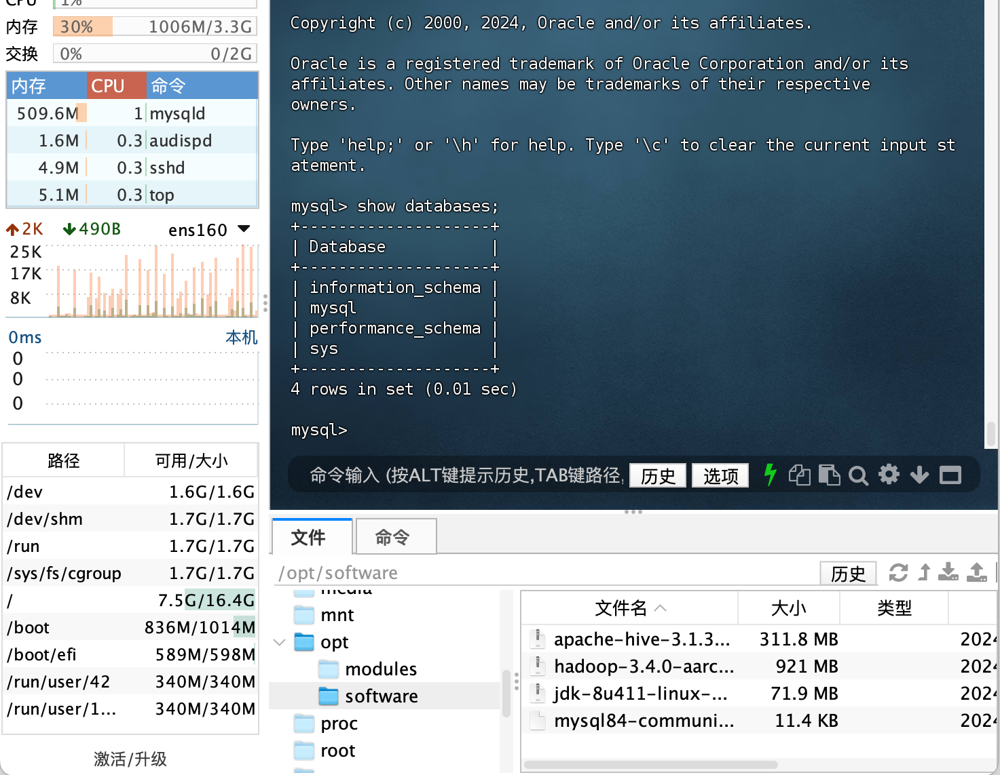
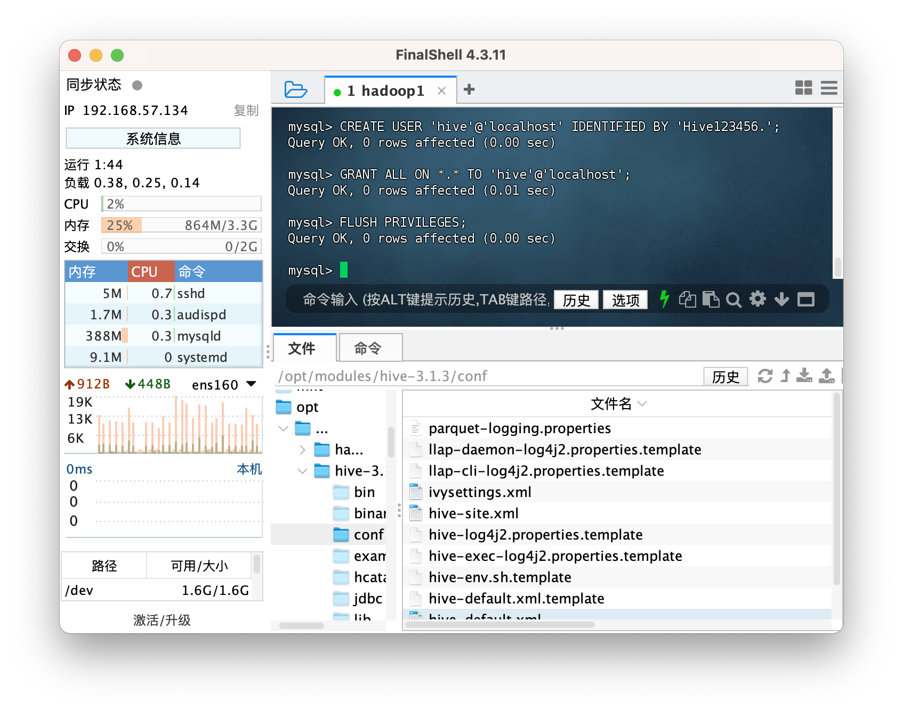

#### 安装 hadoop 参考上一篇：https://blog.csdn.net/Jacob12138/article/details/138716667?csdn_share_tail=%7B%22type%22%3A%22blog%22%2C%22rType%22%3A%22article%22%2C%22rId%22%3A%22138716667%22%2C%22source%22%3A%22Jacob12138%22%7D

# Install Hive on Hadoop，hadoop 基础上安装 hive

## Install MySQL on namenode (hadoop1)，hadoop1 节点安装 MySQL

Hive use MySQL to store meta data， mysql 作为 hive 元数据管理
Hive support MySQL versions，hive 推荐支持的 mysql 版本:
MySQL 5.7.x
MySQL 8.0.x (Only for Hive3.1.x versions)

We use MySQL 8.0.x，我们选择 8.0.x 版本

1. Check already installed mysql, 删除之前的 mysql

```
sudo yum list installed | grep mysql

#Remove previous mysql，如有则删除
sudo yum remove ${xxx}
```

（仅参考）删除以前 mysql data directory "sudo rm -rf /var/lib/mysql"

2. Install mysql-8.0.37, 安装 mysql-8.0.37

- 参考官方文档 https://dev.mysql.com/doc/refman/8.0/en/linux-installation-yum-repo.html
- 下载包 https://dev.mysql.com/get/mysql84-community-release-el7-1.noarch.rpm
- 上传到/opt/software

```
sudo yum install /opt/software/mysql84-community-release-el7-1.noarch.rpm
yum repolist all | grep mysql

# enable 8.0.37 instead of 8.4，开启8.0.37，关闭默认8.4
sudo yum-config-manager --disable mysql-8.4-lts-community
sudo yum-config-manager --disable mysql-tools-8.4-lts-community
sudo yum-config-manager --enable mysql80-community
sudo yum-config-manager --enable mysql-tools-community

# start to install mysql，开始安装mysql到Hadoop1
sudo yum install mysql-community-server
```


3. Start MySQL as service, 后台启动 MySQL

```
sudo systemctl start mysqld
sudo systemctl status mysqld
# 后台关闭mysql
# sudo systemctl stop mysqld
# 取消开机自启动
# sudo systemctl disable mysqld
```


4. Find the temporary password for mysql root user from log，找到 root 用户临时密码，登录后修改密码

```
sudo grep 'temporary password' /var/log/mysqld.log
[Server] A temporary password is generated for root@localhost: :vwyr%Eih0nx
```

Change root user password, passwords contain at least one uppercase letter, one lowercase letter, one digit, and one special character, and that the total password length is at least 8 characters. 至少一个大写，一个小写，一个数字，一个符号，至少 8 位

```
mysql -u root -p
# change password, 修改密码
ALTER USER 'root'@'localhost' IDENTIFIED BY '{new password}';
eixt;
```

5. Test login as root user with new password，测试新密码登录

```
mysql -u root -p
SHOW DATABASES;
```



6. Create mysql user "hive", 创建新 mysql 用户 hive，密码 Hive123456.

```
CREATE USER 'hive'@'localhost' IDENTIFIED BY 'Hive123456.';
# 将所有数据库的所有表的所有权限赋给hive
GRANT ALL ON *.* TO 'hive'@'localhost';
FLUSH PRIVILEGES;
```



7. Check if hive can login remotely, if "Host" is "localhost" means can only login locally，允许 mysql hive 用户远程登录 mysql

```
SELECT Host, User FROM mysql.user WHERE User = 'hive';
UPDATE mysql.user SET Host = '%' WHERE User = 'hive';
FLUSH PRIVILEGES;
exit;
```

## Install hive, 安装 hive

1. Download hive-3.1.3，下载 hive: https://mirrors.tuna.tsinghua.edu.cn/apache/hive/hive-3.1.3/apache-hive-3.1.3-bin.tar.gz

```
tar -zxvf /opt/software/apache-hive-3.1.3-bin.tar.gz -C /opt/modules/
cd /opt/modules/
mv apache-hive-3.1.3-bin hive-3.1.3
```

2. Download mysql java connector, 下载 mysql java 连接器: https://downloads.mysql.com/archives/c-j/

安装 mysql java connector，将 mysql-connector-java.jar 拷贝到/hive-3.1.3/lib 目录下

```
sudo yum install /opt/software/mysql-connector-j-8.0.20-1.el7.noarch.rpm
cp /usr/share/java/mysql-connector-java.jar /opt/modules/hive-3.1.3/lib
```

3. Add hive to env path, 添加 hive 到环境变量

```
sudo vim /etc/profile
# 追加
export HIVE_HOME=/opt/modules/hive-3.1.3
export PATH=$PATH:$HIVE_HOME/bin
```

```
source /etc/profile
```

4. Enable hive config, create hive-site.xml, 开启 hive 默认配置，修改 hive 其他配置

```
cd /opt/modules/hive-3.1.3/conf
mv hive-default.xml.template hive-default.xml
touch hive-site.xml
vim hive-site.xml
```

```
# hive-site.xml
<?xml version="1.0" encoding="UTF-8" standalone="no"?>
<?xml-stylesheet type="text/xsl" href="configuration.xsl"?>

<configuration>
  <!-- 指定mysql地址和数据库 -->
  <property>
    <name>javax.jdo.option.ConnectionURL</name>
    <value>jdbc:mysql://localhost:3306/hive_metastore?createDatabaseIfNotExist=true</value>
  </property>
  <!-- 指定java连接mysql类 -->
  <property>
    <name>javax.jdo.option.ConnectionDriverName</name>
    <value>com.mysql.cj.jdbc.Driver</value>
  </property>
  <!-- 指定连接mysql用户hive -->
  <property>
    <name>javax.jdo.option.ConnectionUserName</name>
    <value>hive</value>
  </property>
  <!-- hive用户mysql密码 -->
  <property>
    <name>javax.jdo.option.ConnectionPassword</name>
    <value>Hive123456.</value>
  </property>
</configuration>
```

5. Initialize hive metadata DB, 初始化 hive 元数据库

```
schematool -dbType mysql -initSchema
mysql -u hive -p
SHOW DATABASES;
```

登录发现 hive_metastore 库被创建


6. 开启 hadoop 后，启动 hive

```
start-all.sh
# wait for a while
hive
```


## Test HiveQL, 测试 hive，HiveQL

1. create hive table, 创建表 employee

```
CREATE TABLE employees (
  id INT,
  name STRING,
  salary FLOAT
);
```

2. Insert dumy data, 插入数据，底层运行 mapreduce

```
INSERT INTO employees VALUES
  (1, 'John Doe', 50000),
  (2, 'Jane Smith', 60000),
  (3, 'Mike Johnson', 55000);
```

3. Select data, 查找数据

```
SELECT * FROM employees;
```

```
# exit, 退出hive
quit;
```


4. Check yarn web ui http://hadoop1:8088, 查看 yarn web ui，mapreduce 程序
   

5. Another option is start hiveserver2, 也可以启动 hiveserver2，使用第三方软件（如 DBeaver）连接 hive

```
hiveserver2
```

- URL: jdbc:hive2://localhost:10000/

- Port，端口: 10000
